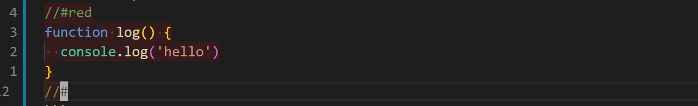

# About

The extension is experimental.  

Color Assist allows you to highlight your code blocks.  
By default the highligh scope is defined by `//#color` and `//#`  

## Example

```JavaScript
//#red
function log() {
  console.log("hello");
}
//#
```

### It will look like that:



# Settings

```JSON
{
"color-assist.comment": "//",
"color-assist.opacity": 0.1
}
```
