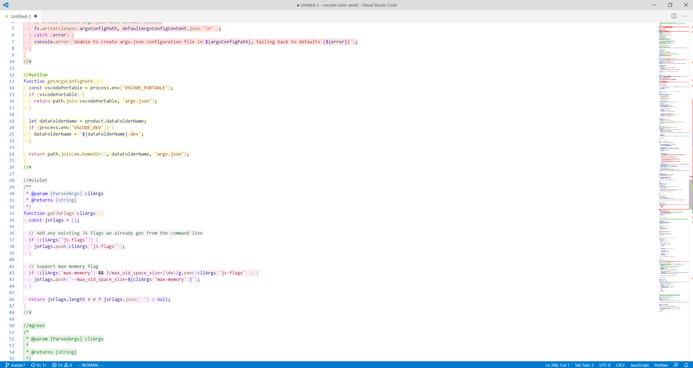

# What does it do?

Color Assist allows you to highlight your code blocks.

Do you find yourself jumping back and forth in your code and not finding what you were looking for?  
That's when this extension can help you the most.  
Just highlight that slippery piece of code and next time you scroll you'll see it immediately.

Color Assist is for "visual" coders :)

# How to use?

To highlight a block of code you need to wrap it with Color Assist scope.  
The highligh scope is defined by the `//#color-name` and `//#`  
See below what I mean.

## JavaScript example

```javascript
//#red
function log() {
  console.log("hello");
}
//#
```

It will look like that:


## Python example

```python
##magenta
def my_function_0():
  print("Hello magenta")
##

##orange
def my_function_1():
  print("Hello orange")
##
```

It will look like that:


# What colors are available?

All 140 web colors: [link](https://htmlcolorcodes.com/)

# What languages are supported?

Oh, the list is gonna be too long... It supports over 70 common languages.

# What else it can do?

Color Assist can also highlight the ruler (see the right side of the image above)  
Also, the opacity can be adjusted.

## Settings

```JSON
{
"color-assist.opacity": 0.1,
"color-assist.ruler": "off"
}
```