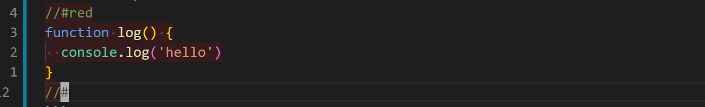
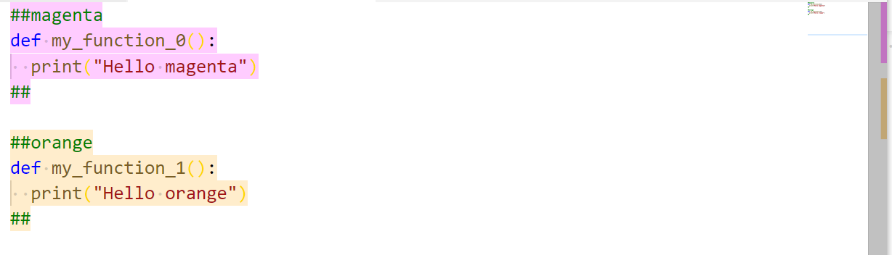

# About

The extension is experimental.

Color Assist allows you to highlight your code blocks.  
The highligh scope is defined by `//#color` and `//#`

## Examples

### JavaScript

```JavaScript
//#red
function log() {
  console.log("hello");
}
//#
```

### It will look like that:



### Python

```Python
##magenta
def my_function_0():
  print("Hello magenta")
##

##orange
def my_function_1():
  print("Hello orange")
##
```

### It will look like that:



## What color are available?

All 140 web colors: [link](https://htmlcolorcodes.com/)

## What else it can do?

Color Assist can also highlight accordingly the ruler  
See the right side of the image above  jj

# Settings

```JSON
{
"color-assist.opacity": 0.1,
"color-assist.ruler": "off"
}
```

# Todo

<!-- options for ruler color (off/only) -->
<!-- darker ruler colors -->
<!-- custom symbol -->
<!-- hex colors -->

highlight in minimap too (just like errors)  
what's the bug when changing file types?  
comment blocks support  
check if contributes works  
